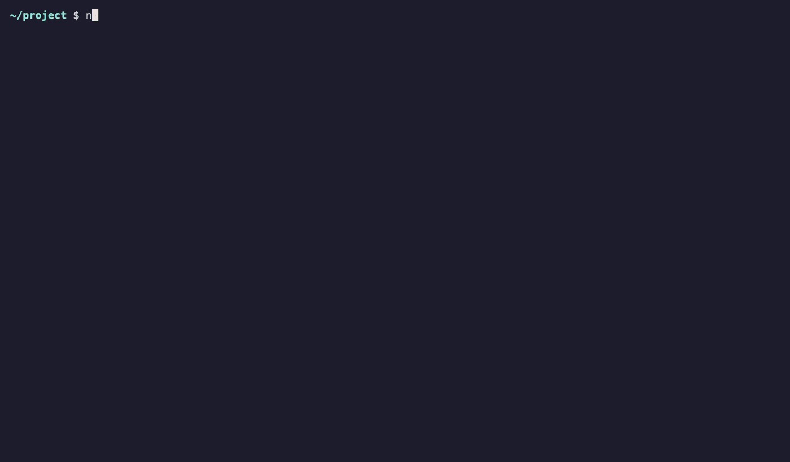

# agent-dashboard.nvim

A floating Neovim dashboard for multiple agent terminals. The sidebar shows live
agent states and recent sessions for the current directory, merging OpenCode and
Claude Code by last activity. Resume a session in an unused terminal (or a new
slot if all are occupied), switch slots without stopping their jobs, and see an
optional status badge in tmux.



*The agents in this recording are simulated. The dashboard, status reporting,
and session resume are the real plugin. See `assets/demo/`.*

## Why it exists

When several AI agents run at once, it's hard to tell which one needs you. One
is waiting for permission, one has finished, and one is still working.

This plugin was inspired by herdr. It brings a similar overview into Neovim, so
it fits workflows where tmux already manages windows and panes.

## Philosophy

- **Stay inside Neovim.** Agents run in Neovim terminals. Hiding the dashboard
  never stops a job.
- **Work alongside tmux.** tmux keeps managing windows and panes. The plugin
  only adds an optional status badge to your existing window format.
- **Use the agents' own tools.** Sessions come from what OpenCode and Claude
  Code already store, and resume with their own commands.
- **Keep the status contract small.** Any agent that writes one JSON file per
  terminal can report live status.
- **Make everything optional.** Reporters, tmux, and notifications are all
  optional. The plugin has no dependencies.
- **Stay out of your config.** The plugin creates no global shortcuts. Its
  terminal keys apply only inside agent terminals.
- **Focus on the current project.** Recent sessions come only from Neovim's
  current working directory.

## Requirements

- Neovim 0.10+
- `opencode` and/or `claude` on `PATH` to resume sessions
- `jq` for the bundled Claude Code reporter
- `tmux` for the optional badge

## Install with lazy.nvim

The repository is private, so ensure GitHub SSH access works first. A minimal
setup that keeps shortcuts under your control:

```lua
{
    "kva4/agent-dashboard.nvim",
    url = "git@github.com:kva4/agent-dashboard.nvim.git",
    lazy = false,
    config = function()
        local dashboard = require("agent_dashboard")
        dashboard.setup()
        vim.keymap.set("n", "<leader>ca", dashboard.toggle, { desc = "Agent dashboard" })
        for index = 1, 3 do
            vim.keymap.set("n", "<leader>c" .. index, function()
                dashboard.toggle_slot(index)
            end, { desc = "Agent terminal " .. index })
        end
    end,
}
```

`setup()` accepts optional values:

```lua
dashboard.setup({
    recent_limit = 10,
    height = 0.78, -- fraction of the available editor height
    tmux = true,
    notifications = { enabled = true, macos = false },
    -- claude_projects = vim.fn.expand("~/.claude/projects"),
    keys = {
        list = "<C-h>", next = "<M-j>", previous = "<M-k>",
        hide = "<C-q>", escape = "jk", capture = "<M-c>",
    },
})
```

The `keys` options are buffer-local in agent terminals. The plugin does not
create global shortcuts; configure those in your Neovim setup. It does not
depend on ToggleTerm.

## Dashboard controls

| Where | Keys | Action |
| --- | --- | --- |
| Agent terminal | `<C-h>` | Focus the sidebar |
| Agent terminal (normal mode) | `<Tab>` / `<C-w>h` | Focus the sidebar |
| Agent terminal | `<M-j>` / `<M-k>` | Next / previous slot (wraps) |
| Agent terminal | `<C-q>` | Hide dashboard without stopping agents |
| Sidebar | `j` / `k`, `<CR>` | Select and open a slot or recent session |
| Sidebar | `1`–`9` | Open a slot (or create the next one) |
| Sidebar | `<Tab>`, `<C-l>`, `l`, `<Right>`, `<C-w>l` | Return to the active terminal and enter terminal mode |
| Sidebar | `x` | Remove a terminal slot or delete a recent session (asks for confirmation) |
| Sidebar | `a`, `y`, `D`, `C`, `t`, `n`, `c`, `?` | Add slot / copy session id / delete recent session or save topic note / consolidate topic / attach or detach topic / browse topic notes / capture findings for the selected source / show help |
| Sidebar | `q` / `<Esc>` | Hide dashboard |

The dashboard starts with an unused shell. You can launch any agent yourself;
recent sessions appear in the sidebar and can be resumed with the matching CLI.
Slot names show session titles once known. A running session is opened in its
existing slot, rather than resumed a second time. Only sessions belonging to
Neovim's current working directory are shown. Recent sessions refresh when the
dashboard opens and every 30 seconds while visible.

The status symbols are `!` blocked, `●` working, `○` idle, `✓` unseen completed
turn, and `?` unknown. Status reports are optional; without one, the terminal
still works and shows `shell`.

Hidden slots notify with `vim.notify` when they become blocked or finish a turn.
Set `notifications = false` to disable notifications, or use
`notifications = { enabled = true, macos = true }` to also show a macOS banner.
`require("agent_dashboard").status()` returns the same badge used by tmux and can
be included in a statusline.

## Commands and editor context

`:AgentDashboard` toggles the dashboard. Subcommands include `open N`, `add`,
`send [selection|file|location]`, and `hooks`. The hooks command prints a
ready-to-paste Claude Code hooks object using the installed reporter path.

Send the last visual selection with `:AgentDashboard send` (or
`:AgentDashboard send selection`), the current file with `:AgentDashboard send file`,
or the current `@path:line` with `:AgentDashboard send location`. Visual-mode Lua
mappings can call `dashboard.send_context()` directly to send the active selection.
Prefix a range, such as `:10,20AgentDashboard send`, to send those lines. Context is
inserted into the selected running terminal using bracketed paste, preserving
multiline selections without submitting them automatically.

## Topics

Topics keep reviewed knowledge across agent sessions and projects as editable
Markdown files. They are stored under
`stdpath("data") .. "/agent-dashboard/topics"` by default. Create and attach one
to the selected slot with:

```vim
:AgentDashboard topic new billing-migration
:AgentDashboard topic attach billing-migration
```

From an agent terminal, press `<M-c>` (Alt-C; configurable as
`keys.capture`, default `<M-c>`) to open capture for that session. In the
dashboard, press `c` on a slot row to capture from that slot (using its attached
topic when available), or on a topic row to capture that topic from the currently
selected slot. Choose a destination topic, enter
optional focus text, then select **Save findings** or **Propose brief**. Capture
requires a session that has an idle status report; an unreported shell or a
working/unknown session is not eligible. The capture runs separately from the
agent terminal, so its response is not pasted into the conversation and is not
submitted as a prompt there. The initial release does not start capture
automatically after an agent turn.

Save findings creates a distinct note with source project/session provenance.
Propose brief makes a session-based proposal distinct from note consolidation;
review the proposal and explicitly accept or reject it. Optional focus text
narrows the requested subject. Each capture makes an additional model request.
The capture helper is disposable: known, journaled helper sessions are filtered
from recent sessions and cleaned up after capture. If cleanup cannot be
confirmed, the helper is retained for startup reconciliation rather than
guessing by recency. A failed topic-file save keeps generated output at a
recoverable local path before deleting the helper. Cleanup problems are shown
separately from a successful save. OpenCode's API generates fork IDs server-side:
a crash before its fork response is journaled can leave an unidentified helper
that cannot be automatically deleted. That case is reported explicitly.

Capture has been checked with Claude Code 2.1.286 and OpenCode 1.18.30. OpenCode
capture also uses `curl` for its private local server and `ps` for crash recovery.

The dashboard shows capture state in the sidebar. While active, `X` cancels;
after failure, `o` opens output, `e` shows diagnostics, `R` retries, and `d`
dismisses; after success, `o` opens a note, `r` reviews a brief proposal, and `d`
dismisses. A capture whose
source slot has gone away is shown in the orphan-capture section with the same
available actions. Retry repeats the latest failed/cancelled request when the
original source is still reported idle.

`:AgentDashboard note [topic]` remains available for saving the current editor
selection or range with its project and session source. Topic attachments are
session-local to the current Neovim process.

The older distill/brief prompt-pasting workflow is not the capture interface.
Do not configure or rely on legacy distill/brief prompt settings for capture.

Claude Code receives the brief from the configured `SessionStart` reporter.
OpenCode receives a brief-reading prompt only when the dashboard resumes a
session in an attached slot, after the reporter identifies that session as idle.
The prompt is pasted once without submitting it; press Enter to send it. Manual
OpenCode starts do not receive this prompt. Claude's next SessionStart reads the
current attachment from a per-slot file, so attaching or detaching takes effect
without restarting the shell. Topic attachments last for the current Neovim process; the files
remain on disk and can be placed in a Git repository if you want to share them.
See [`docs/design/topics.md`](docs/design/topics.md) for the storage format,
configuration, Lua API, and workflow details.

## Agent status reporting

Each dashboard terminal has `NVIM_AGENT_DASHBOARD_DIR` and `NVIM_AGENT_SLOT` in
its environment. A reporter writes JSON to
`$NVIM_AGENT_DASHBOARD_DIR/$NVIM_AGENT_SLOT.json` with
`{slot, time, session, turn, state, agent, pid?, heartbeat?}`. `state` is one of
`idle`, `working`, `blocked`, or `unknown`. Use `session: "none"` when the agent
is running with no session selected; the slot then shows as idle. The bundled integrations below are
optional for resuming sessions, but required for accurate live status and for
recognizing sessions started manually in an existing terminal.

### OpenCode

The TUI-specific reporter is in `extras/opencode/agent-dashboard-tui.js`.
Copy it to `~/.config/opencode/agent-dashboard-tui.js`, then add it to your
`~/.config/opencode/tui.jsonc` plugin array (preserving other plugins):

```jsonc
{
  "plugin": ["./agent-dashboard-tui.js"]
}
```

This is a TUI plugin: the selected session belongs to the terminal that owns
it. A server-wide plugin cannot reliably identify that terminal. Restart
OpenCode after changing its TUI plugin configuration.

### Claude Code

The hook reporter is in `extras/claude/agent-dashboard-report.sh`. Wire it into
`~/.claude/settings.json`; for example, if lazy.nvim installs the plugin under
`~/.local/share/nvim/lazy/agent-dashboard.nvim`:

```json
{
  "hooks": {
    "SessionStart": [{"hooks": [{"type": "command", "command": "bash $HOME/.local/share/nvim/lazy/agent-dashboard.nvim/extras/claude/agent-dashboard-report.sh start"}]}],
    "UserPromptSubmit": [{"hooks": [{"type": "command", "command": "bash $HOME/.local/share/nvim/lazy/agent-dashboard.nvim/extras/claude/agent-dashboard-report.sh working"}]}],
    "Stop": [{"hooks": [{"type": "command", "command": "bash $HOME/.local/share/nvim/lazy/agent-dashboard.nvim/extras/claude/agent-dashboard-report.sh idle"}]}],
    "Notification": [{"matcher": "permission_prompt", "hooks": [{"type": "command", "command": "bash $HOME/.local/share/nvim/lazy/agent-dashboard.nvim/extras/claude/agent-dashboard-report.sh blocked"}]}],
    "SessionEnd": [{"hooks": [{"type": "command", "command": "bash $HOME/.local/share/nvim/lazy/agent-dashboard.nvim/extras/claude/agent-dashboard-report.sh end"}]}]
  }
}
```

Add `PreToolUse` / `PostToolUse` with `working` if you want more precise live
status. Keep the `Notification` matcher set to `permission_prompt` so idle
notifications do not mark Claude as blocked. Preserve your existing
hooks and adjust the path when installing elsewhere. The script does nothing
outside a dashboard terminal. Restart Claude Code after changing its hooks.

## Check

```sh
nvim --headless -u NONE -i NONE -l tests/agent_dashboard.lua
nvim --headless -u NONE -i NONE -l tests/topics.lua
nvim --headless -u NONE -i NONE -l tests/topics_dashboard.lua
nvim --headless -u NONE -i NONE -l tests/topics_delivery.lua
node --check extras/opencode/agent-dashboard-tui.js
bash -n extras/claude/agent-dashboard-report.sh
```

To re-record the demo GIF, install [VHS](https://github.com/charmbracelet/vhs)
and run `vhs assets/demo/demo.tape` from the repo root in a regular terminal.

Run `:checkhealth agent_dashboard` to verify `jq`, the agent CLIs, and reporter
configuration. See `doc/agent-dashboard.txt` for the full command and Lua API
reference.
